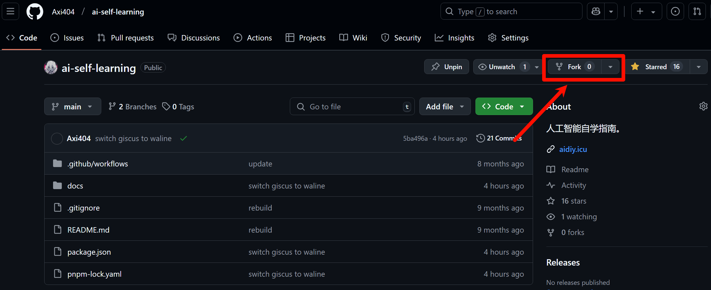
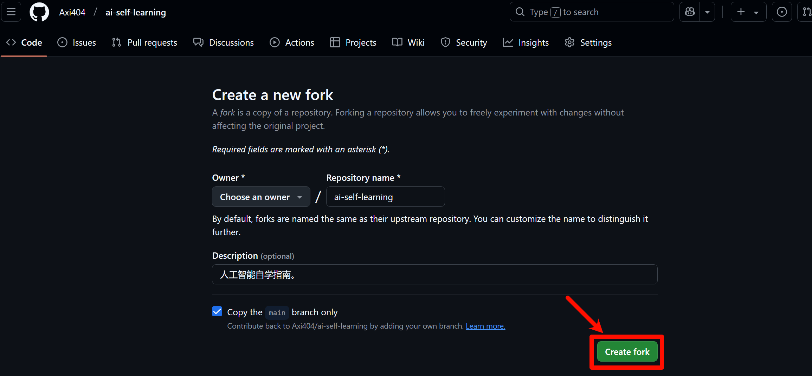
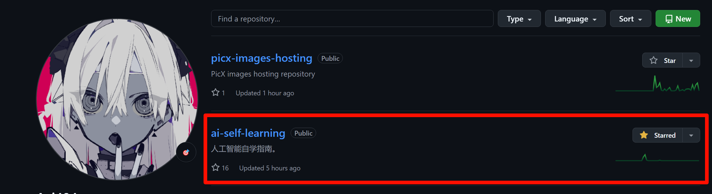
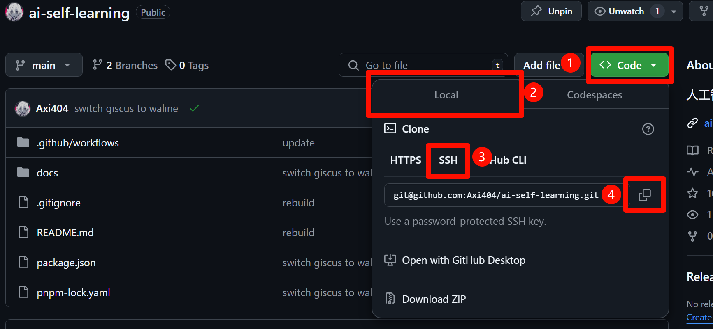

import { Steps } from '@astrojs/starlight/components';
import { FileTree } from '@astrojs/starlight/components';

:::note[提示]
本文档在撰写之初，使用的框架为 Vitepress 而非现在使用的 Astro，因此可能导致部分内容稍微不符合，若影响正常阅读，请在 Issue 中留言。
:::

本部分将讲解详细的基本配置与部署流程，其中包括的前置技能有 <u>Git 的使用</u>以及 <u>Markdown 的撰写</u>。相关技能的初步了解可以前往 [廖雪峰的 Git 教程](https://www.liaoxuefeng.com/wiki/896043488029600) 以及 [Markdown 官方教程](https://markdown.com.cn/basic-syntax/) 进行学习。

### 注册 Github 账号

作为贡献者，首先需要注册 Github 账号，这一步十分的简单，前往 [Github 官网](https://github.com/) 并点击 `Sign Up`，根据要求进行注册即可，在这里并不进行过多的讲解。

### 初始化本地 Git 并配置 SSH

在 [Git 官网](https://git-scm.com/) 选择下载 Windows 版本并按照提示进行安装。


在安装中需要注意的是：

<Steps>

1. 在 `Select Components` 中选择 `Git LFS`，按需求安装其他组件。
2. 在 `Adjusting the name of the initial branch in new repositories` 中可以选择 `Override the default branch name for new repositories` 并将主分支命名为 `main`（貌似是因为原默认名称 `master` 涉及种族歧视，如今 Github 默认分支为 `main`，最好保持一致）。
3. 在 `Adjusting your PATH environment` 中选择 `Recommended` 的选项。
4. 其他内容选择默认选项即可，或者在互联网进行查询。

</Steps>

安装之后首先设置 Git 的基本信息：

```shell
git config --global user.name "Your Name"
git config --global user.email "Your Email"
```

之后需要配置 SSH，首先需要检查是否已经存在 SSH 密钥，如果存在则跳过此步骤，否则需要进行创建：

```shell
ssh-keygen -t ed25519 -C "Your Email"
# 或者使用 ssh-keygen -t rsa -C "Your Email"
cat ~/.ssh/id_ed25519.pub
# cat ~/.ssh/id_rsa.pub
```

将生成的密钥复制到 Github 中的 `Settings` 中的 `SSH and GPG keys` 中的 `New SSH key` 并粘贴。

此时本地理论上已经可以进行 Git 的 push 等操作到远程储存库了。

### Fork 本仓库

进入本仓库的 [Github 主页](https://github.com/CS-BAOYAN/CS-BAOYAN-2025)，点击 `Fork` 按钮，即可将本仓库 Fork 到自己的 Github 账号下。





Fork 操作本质上是复制了一份本仓库到自己的账号下，并在自己的账号下享有修改的权限，同时可以比较自己账号下的仓库与上游仓库之间的更改差别，Fork后的仓库可以在自己账号的 Repositories 中看到。

import { Aside } from '@astrojs/starlight/components';


<Aside type='note'>笔者拥有本仓库，在读者的界面中，Fork 的仓库下方应当有 `Forked from` 字样。</Aside>



### 克隆仓库

在 Fork 完成之后，在自己 Fork 的仓库中，找到并点击 `< > Code` 按钮，之后点击 `SSH` 按钮，并复制链接。



在本地找到适合保存本项目的文件夹，右键资源管理器，点击 `在终端中打开`，并进行克隆操作。

```shell
git clone your_ssh
```

:::caution[警告]
对于之前没有运行过 `git clone` 或者运行 `ssh git@github.com` 的用户，很可能会出现信息提示：

```text
The authenticity of host 'github.com (xxx.xxx.xxx.xxx)' can't be established.
xxxxxxx key fingerprint is sHA256:xxx.
This key is not known by any other names.
Are you sure you want continue connecting(yes/no/[fingerprint])?
```

需要明确输入 `yes` 并回车，否则无法正确建立连接。
:::

### 仓库文件结构

在克隆完成之后，可以使用 [VSCode](https://code.visualstudio.com/) 等编辑器打开文件夹并进行编辑，其中首先需要了解的是文件的结构：

<FileTree>
- .github
    - workflows
        - deploy.yml
- node_modules/
- public/
- src
    - assets/
    - components/
    - content
        - docs
            - images/
            - **folders**
                - index.md
- .gitignore
- **astro.config.mjs**
- package.json
- pnpm-lock.yaml
- README.md
- tsconfig.json
</FileTree>

其中例如 `.gitignore`, `package.json`, `pnpm-lock.yaml`, `tsconfig.json` 均为 Git 以及 Node.js 的相关配置文件，无需过于调整。其中 `astro.config.mjs` 为 astro 的配置文件，而其他的文件夹则按照文档的组织进行排序，其中本项目中全部的图片均维护在 `src/content/docs/images` 文件夹中。读者需要关注的除了 `astro.config.mjs` 之外，其余的只需要关注 `src/content/docs` 文件夹，并在其中组织你的 Markdown 文档。

### 安装 NodeJS

前往 [NodeJS 官网](https://nodejs.org/zh-cn/download/prebuilt-installer) 下载预构建安装程序，之后运行并进行安装即可，在这里不进行赘述。

在安装之后进入 Shell 并查看 NodeJS 版本并安装 pnpm：

```shell
node -v
npm -v
npm install -g pnpm
```

对于 Ubuntu 则可以使用：

```bash
sudo apt install nodejs
sudo npm install n -g
sudo n 20.16.0
npm -v
node -v
# 如果为 20.16.0 则执行，否则重启终端或者尝试执行 hash -r
npm install -g bun
```

### 构建项目

在项目根目录下打开终端并运行：

```shell
bun i
bun dev
```

第一行进行依赖的安装，第二行进行项目的运行，此时可以在本地访问网页，具体 url 见终端输出。