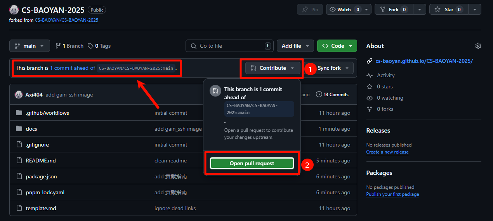
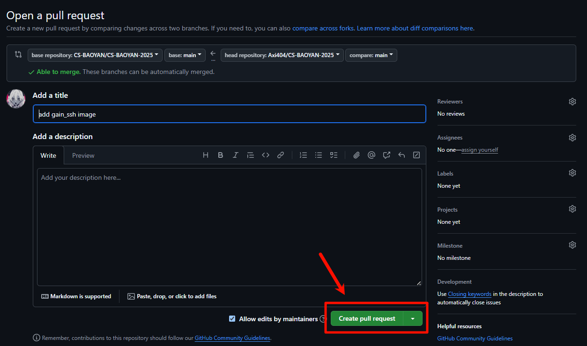

### 提交更改

在完成了文档的修改之后，可以使用 Git 进行更改的提交：

```shell
git pull origin main
git add .
git commit -m "your commit message"
git push origin main
```

之后可以看到自己的更改已经提交到了自己的 Github 仓库中。

### 发起 Pull Request

import { Aside } from '@astrojs/starlight/components';

<Aside type='note' title='注意'>此处插图使用笔者为另一个项目提交 PR 的截图，请读者根据实际情况进行操作。</Aside>

假如说进行了成功的提交，可以注意到，自己的仓库中应显示如 `1 commit ahead of` 的字样。点击 `Contribute` 并点击 `Open pull request` 即可发起一个 Pull Request，并等待管理员进行审核。



请确保 PR 的 title 中表意明确，同时 description 中清晰描述了自己添加的内容，之后点击 `Create pull request` 即可，管理员在收到内容之后会进行审查并给出 `comment` 或直接将你的 PR Merge 进主分支，即完成了贡献。



请确保 PR 的 title 中表意明确，同时 description 中清晰描述了自己添加的内容，之后点击 `Create pull request` 即可，管理员在收到内容之后会进行审查并给出 `comment` 或直接将你的 PR Merge 进主分支，即完成了贡献。


### 追踪进度

在 PR 被发起之后，CS-BAOYAN-Wiki 的维护者会在 PR 的页面中给出进度的更新。你可以来到 CS-BAOYAN-Wiki 的 `Pull requests` 页面来追踪进度。我们可能会给出一些修改建议的反馈，并要求你进行修改，或者直接通过你的 PR，这取决于你的提交，所以请在 PR 被 Merge 进主分支之前，保持关注。
