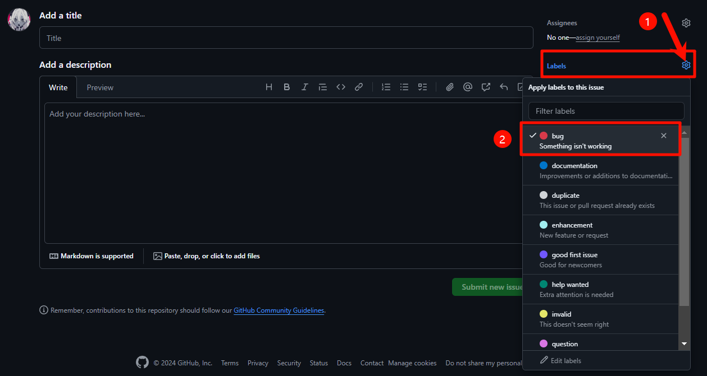

我们希望使用 Issue 来集中管理和跟踪需求以及问题。

### Bug Repost

如果你在使用过程中发现了 Bug，请按照以下步骤提交 Issue：

1. 确认 Bug 是否已经在最新版本中修复。
2. 确认 Bug 是否已经在 Issue 列表中被报告过。
3. 如果 Bug 已经在 Issue 列表中被报告过，请在评论中附上相关信息，帮助我们定位问题。
4. 如果 Bug 还没有被报告过，请添加 Issue，解释目前的情况，并附上相关信息，帮助我们定位问题。
5. 为 Issue 添加 Labels，`bug`。

### 内容需求

假如说你希望添加在 CS-BAOYAN-Wiki 中添加新的内容，这些内容你并不了解如何撰写，或者暂时没有时间撰写并发起 PR，你可以在 Issue 中提出，并且在后续撰写，或者在此之前其他的贡献者帮助你完成。方法同上，在 Issue 中添加 `documentation` Label，并详细描述你希望添加的内容。

我们欢迎大家在已经列出的 Issue 中进行讨论，并且附上一些可供参考的其他文章/材料/链接，并且丰富每个页面的内容。
